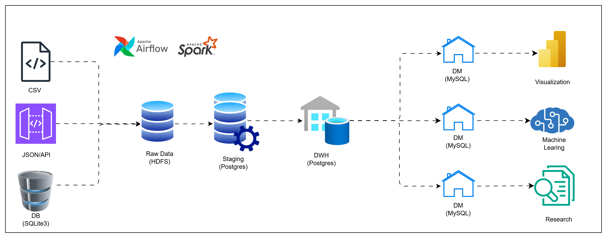

# Logistic Data Warehouse

A modern data engineering infrastructure for logistics and delivery operations, implementing a complete ETL pipeline: (Raw → Staging → Data Warehouse → Data Mart).

## Architecture Overview

```html

```

## Tech Stack

| Component | Technology |
|-----------|------------|
| Data Processing | Apache Spark (PySpark) |
| Orchestration | Apache Airflow |
| Raw Storage | HDFS (Hadoop Distributed File System) |
| Data Warehouse | PostgreSQL |
| Data Mart | MySQL |
| Source Database | SQLite |
| File Formats | CSV, JSON, Parquet |

## Project Structure

```
Logistic Data Warehouse/
├── dags/                              # Airflow DAG definitions
│   ├── logistic_1_1_ingest_csv.py
│   ├── logistic_1_2_ingest_database.py
│   ├── logistic_1_3_ingest_json.py
│   ├── logistic_2_hdfs_to_staging.py
│   ├── logistic_3_staging_to_dwh.py
│   └── logistic_4_dwh_to_datamart.py
├── etl/                               # Spark ETL scripts
│   ├── spark_ingest_csv.py
│   ├── spark_ingest_database.py
│   ├── spark_ingest_json.py
│   ├── spark_hdfs_to_postgres.py
│   ├── spark_staging_to_dwh.py
│   └── spark_dwh_to_datamart.py
├── sql/                               # Database schemas
│   ├── staging/create_staging.sql
│   ├── data warehouse/create_dwh.sql
│   └── data mart/create_dm.sql
├── data/
│   ├── data_sources/                  # Source data files
│   │   ├── customers.csv
│   │   ├── drivers.csv
│   │   ├── packages.json
│   │   ├── vehicles_api.json
│   │   └── logistics_source.db
│   └── generate_data_sources.py       # Test data generator
├── jdbc/                              # Database drivers
│   ├── postgresql-42.6.0.jar
│   ├── mysql-connector-j-8.3.0.jar
│   └── sqlite-jdbc-3.51.1.0.jar
└── requirements.txt
```

## Data Model

### Staging Layer (PostgreSQL)
7 temporary tables for raw data landing:
- `stg_customer`, `stg_driver`, `stg_vehicle`, `stg_package`
- `stg_route`, `stg_warehouse`, `stg_delivery`

### Data Warehouse - Star Schema (PostgreSQL)

**Dimension Tables (6):**
| Table | Description |
|-------|-------------|
| `dim_date` | Time dimension (year, month, quarter, weekday) |
| `dim_customer` | Customer master with SCD Type 2 |
| `dim_driver` | Driver master with SCD Type 2 |
| `dim_vehicle` | Vehicle fleet with SCD Type 2 |
| `dim_route` | Route definitions with SCD Type 2 |
| `dim_warehouse` | Warehouse locations with SCD Type 2 |

**Fact Table:**
| Table | Description |
|-------|-------------|
| `fact_delivery` | Delivery transactions with metrics (costs, durations, quality flags) |

### Data Mart (MySQL)
Aggregated analytics tables:
- `mart_customer_analytics` - Customer KPIs and loyalty metrics
- `mart_delivery_performance` - Daily/monthly/quarterly performance

## Key Features

- **SCD Type 2**: Full historical tracking of dimension changes with effective_date/expiry_date
- **Data Quality**: Null filtering, deduplication, email/phone validation, string trimming
- **Partitioning**: Date-based partitioning in HDFS and fact tables
- **Daily Scheduling**: Automated pipeline execution via Airflow

## Prerequisites


| Component         | Version/Requirement | Installation Link |
|-------------------|--------------------|-------------------|
| Apache Spark      | 3.x                | [Install Guide](https://github.com/Nhaaa4/Data-Engineering-Tools/blob/main/spark_installation.md) |
| Apache Airflow    | 2.x                | [Install Guide](https://github.com/Nhaaa4/Data-Engineering-Tools/blob/main/airflow_installation.md) |
| Hadoop/HDFS       | Latest             | [Install Guide](https://github.com/Nhaaa4/Data-Engineering-Tools/blob/main/hadoop_installation.md) |
| PostgreSQL        | Latest             | [Install](https://www.postgresql.org/download/) |
| MySQL             | Latest             | [Install](https://dev.mysql.com/downloads/mysql/) |
| Python            | 3.x                | [Install](https://www.python.org/downloads/) |

## Installation

> **Note:** This project was built and tested on Ubuntu Server/Ubuntu Desktop. Some features may require adjustments for Windows or macOS.

### Step 1: Clone Repository

```bash
git clone https://github.com/Nhaaa4/Logistic-DataWareHouse-And-DataMart.git logistic
cd logistic
```

### Step 2: Install Python Dependencies

```bash
pip install -r requirements.txt
```

### Step 3: Generate Sample Data

Generate the source data files (CSV, JSON, SQLite):

```bash
python data/generate_data_sources.py
```

This creates sample data in `data/data_sources/`. See [Generate Data Guide](docs/generate-data.md) for details.

### Step 4: Create Databases

Set up PostgreSQL (staging + DWH) and MySQL (data mart):

```bash
# PostgreSQL - Create database and schemas
psql -U postgres -c "CREATE DATABASE logistics_dwh;"
psql -U postgres -d logistics_dwh -f sql/staging/create_staging.sql
psql -U postgres -d logistics_dwh -f "sql/data warehouse/create_dwh.sql"

# MySQL - Create data mart
mysql -u root -p < "sql/data mart/create_dm.sql"
```

See [Database Setup Guide](docs/database-setup.md) for detailed instructions.

### Step 5: Configure Airflow

1. Copy DAG files to your Airflow DAGs directory:

```bash
cp dags/*.py ~/airflow/dags/
```

2. Update database connection settings in the DAG files
3. Start Airflow scheduler and webserver

See [Airflow Setup Guide](docs/airflow-setup.md) for detailed instructions.

### Step 6: Access Airflow UI

Open your browser and navigate to:

```
http://localhost:8080
```

Or for remote servers: `http://<server-ip>:8080`

## Configuration

Update database connections in the DAG files:

| Database | Host | Port | Default User | Password |
|----------|------|------|--------------|----------|
| PostgreSQL | localhost | 5432 | postgres | XXXXX |
| MySQL | localhost | 3306 | root | XXXXX |
| HDFS | localhost | 9000 | - | - |

## Pipeline Schedule

| DAG | Schedule | Description |
|-----|----------|-------------|
| logistic_ingest_csv | 1:00 AM | Ingest CSV files to HDFS |
| logistic_ingest_database | 1:00 AM | Ingest SQLite to HDFS |
| logistic_ingest_json | 1:00 AM | Ingest JSON APIs to HDFS |
| logistic_hdfs_to_staging | 2:00 AM | Load HDFS to PostgreSQL staging |
| logistic_staging_to_dwh | 3:00 AM | Transform staging to DWH |
| logistic_dwh_to_datamart | 5:00 AM | Build analytics data mart |

## License

This project is for educational purposes.
